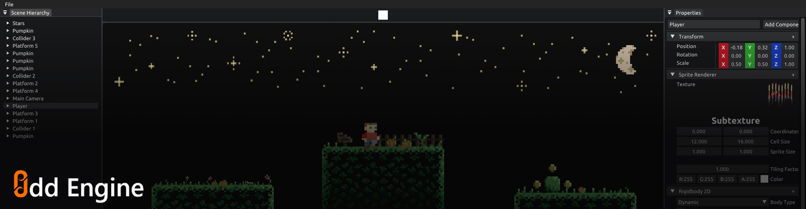
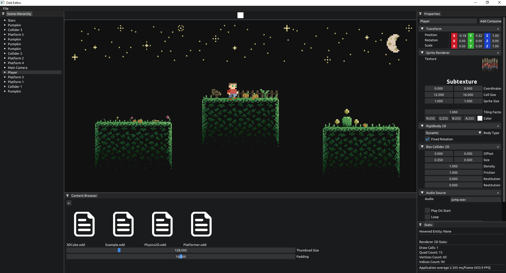

# Odd Engine <!-- omit in toc -->



## Contents <!-- omit in toc -->

- [Introduction](#introduction)
- [Features](#features)
- [Setup](#setup)
- [Build](#build)
  - [Supported Platforms](#supported-platforms)
  - [Dependencies](#dependencies)
  - [Build with CMake](#build-with-cmake)
- [Controls](#controls)
- [Snapshots](#snapshots)
- [License](#license)

## Introduction 
 
This is a WIP game engine that supports 3D rendering and has a beautiful editor. It's based on Entity Component approach and uses OpenGL to render graphics.   

## Features

- Audio System
- Physics 2D System
- Native Scripting
- Sprite Rendering with Subtextures
- 2D Batch Rendering
- Scene Loading/Resetting with Serialization
- Entity Component System
- Cross-platform API (Currently Supports OpenGL)
- Profiler
- Input System
- Event System

## Setup 
 
Prerequisites: [git](https://git-scm.com/downloads).

Clone the repo using the following command:

```
git clone --recurse https://github.com/oddStoneGames/Odd.git
cd Odd
```

## Build 
 
### Supported Platforms  
- Windows
- Linux

### Dependencies 
 
- Hardware with support for OpenGL 4.6 Core
- C++ Compiler with C++ 17 Support
- CMake Version 3.25

### Build with CMake

- Windows (MSVC):

  `Step 1.` Generate project files & open the project.
  ```
  cmake -S . -B ./build
  cd build
  Odd-Editor.sln
  ```

  `Step 2.` To Build & Run the project, you can click on Local Windows Debbuger.

## Controls

For moving around the viewport:  
- Rotate: Left Alt + Left Mouse Button
- Move: Left Alt + Middle Mouse Button
- Pan: Left Alt + Right Mouse Button

For Accessing gizmos on selected entity:
- Translate: W
- Rotate: E
- Scale: R

## Snapshots



## License 
 
See [LICENSE](LICENSE).

This project has some third-party dependencies, each of which may have independent licensing:

- [Box2D](https://github.com/erincatto/box2d): Box2D is a 2D physics engine for games
- [EnTT](https://github.com/skypjack/entt): A fast and reliable entity component system (ECS).
- [GLAD](https://glad.dav1d.de/): Multi-Language GL/GLES/EGL/GLX/WGL Loader-Generator based on the official specs.
- [GLFW](https://github.com/glfw/glfw): A multi-platform library for OpenGL, OpenGL ES, Vulkan, window and input
- [GLM](https://github.com/g-truc/glm): OpenGL Mathematics
- [Dear ImGui](https://github.com/ocornut/imgui): Immediate Mode Graphical User Interface
- [ImGuizmo](https://github.com/CedricGuillemet/ImGuizmo): Immediate mode 3D gizmo for scene editing and other controls based on Dear ImGui.
- [libsndfile](https://github.com/libsndfile/libsndfile): A C library for reading and writing sound files containing sampled audio data.
- [OpenAL-Soft](https://github.com/oddStoneGames/openal-soft): OpenAL Soft is a software implementation of the OpenAL 3D audio API.
- [spdlog](https://github.com/gabime/spdlog): Fast C++ logging library.
- [stb_image](https://github.com/nothings/stb): Single-file public domain (or MIT licensed) libraries.
- [yaml-cpp](https://github.com/jbeder/yaml-cpp): A YAML parser and emitter in C++.