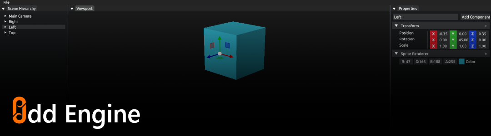

# Odd Engine <!-- omit in toc -->



## Contents <!-- omit in toc -->

- [Introduction](#introduction)
- [Setup](#setup)
- [Build](#build)
  - [Supported Platforms](#supported-platforms)
  - [Dependencies](#dependencies)
  - [Build with Premake](#build-with-premake)
- [Controls](#controls)
- [Snapshots](#snapshots)
- [License](#license)

## Introduction 
 
This is a WIP game engine that supports 3D rendering and has a beautiful editor. It's based on Entity Component approach and uses OpenGL to render graphics.   

## Setup 
 
Prerequisites: [git](https://git-scm.com/downloads).

Clone the repo using the following command:

```
git clone https://github.com/oddStoneGames/Odd.git
cd Odd
```

## Build 
 
### Supported Platforms  
- Windows

### Dependencies 
 
- Hardware with support for OpenGL 4.6 Core
- Microsoft Visual Studio Community 2019+

### Build with Premake 
 
`Step 1.` Generate the project files.
- For Visual Studio Community 2019

    ```
    premake5.exe vs2019
    ```
- For Visual Studio Community 2022

    ```
    premake5.exe vs2022
    ```

`Step 2.` Open the Project.

```
Odd.sln
```

`Step 3.` To Build & Run the project, you can click on Local Windows Debbuger.

## Controls

For moving around the viewport:  
- Pan: Left Alt + Left Mouse Button
- Rotate: Left Alt + Middle Mouse Button
- Move: Left Alt + Right Mouse Button

For Accessing gizmos on selected entity:
- Translate: W
- Rotate: E
- Scale: R

## Snapshots


## License 
 
See [LICENSE](LICENSE).

This project has some third-party dependencies, each of which may have independent licensing:

- [EnTT](https://github.com/skypjack/entt): A fast and reliable entity component system (ECS).
- [GLAD](https://glad.dav1d.de/): Multi-Language GL/GLES/EGL/GLX/WGL Loader-Generator based on the official specs.
- [GLFW](https://github.com/glfw/glfw): A multi-platform library for OpenGL, OpenGL ES, Vulkan, window and input
- [GLM](https://github.com/g-truc/glm): OpenGL Mathematics
- [Dear ImGui](https://github.com/ocornut/imgui): Immediate Mode Graphical User Interface
- [ImGuizmo](https://github.com/CedricGuillemet/ImGuizmo): Immediate mode 3D gizmo for scene editing and other controls based on Dear ImGui.
- [spdlog](https://github.com/gabime/spdlog): Fast C++ logging library.
- [stb_image](https://github.com/nothings/stb): Single-file public domain (or MIT licensed) libraries.
- [yaml-cpp](https://github.com/jbeder/yaml-cpp): A YAML parser and emitter in C++.